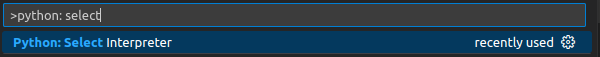
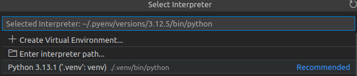

# Python CI/CD Kata


This repository contains a very simple web service that simulates rolling a die by generating a random number. The main purpose of this project is to help you practice and understand key concepts of Continuous Integration (CI) and Continuous Deployment (CD). Throughout this workshop, you will explore how to set up a CI/CD pipeline with GitHub Actions for code quality checks, deliver the image to DockerHub and deploy to Render.

- **Workshop slides**: [View the slides](https://docs.google.com/presentation/d/17neLk6ssM7UQ9Pdps_acDprkiNpDgS43Ql9k1R6lwus/edit?usp=sharing)
- **Deployed service**: [https://simple-service-wvoo.onrender.com](https://simple-service-wvoo.onrender.com)
  _Note: Render will spin down the service if it doesn't receive requests for the last 15 minutes. For more details, check [this page](https://render.com/docs/free#spinning-down-on-idle)._

## Table of Contents

- [Python CI/CD Kata](#python-cicd-kata)
  - [Table of Contents](#table-of-contents)
  - [Prerequisites](#prerequisites)
  - [Local Development Setup](#local-development-setup)
    - [Dependencies](#dependencies)
    - [Pre-commit hooks](#pre-commit-hooks)
    - [Local development server](#local-development-server)
  - [Code quality](#code-quality)
    - [Linter](#linter)
    - [Formatter](#formatter)
    - [Static type checker](#static-type-checker)
    - [Tests](#tests)
  - [Deployment](#deployment)
    - [Docker and Docker Hub](#docker-and-docker-hub)
    - [Deploying the Docker Image to Render](#deploying-the-docker-image-to-render)
  - [Running GitHub Actions Locally with Act](#running-github-actions-locally-with-act)
  - [Deliverable Instructions](#deliverable-instructions)
    - [Submission](#submission)
    - [Notes](#notes)

## Prerequisites

- Install `uv`: [Installation Guide](https://docs.astral.sh/uv/getting-started/installation/)
- Install Docker Engine:
  - On Mac and Windows, install Docker Desktop.
  - On Linux, install Docker Engine: [Installation Steps](https://docs.docker.com/engine/install/)
  - Post-installation: Run Docker as a non-root user: [Guide](https://docs.docker.com/engine/install/linux-postinstall/#manage-docker-as-a-non-root-user)
- Create a DockerHub account (you can sign up using GitHub): [DockerHub](https://hub.docker.com)
- Create a Render account (you can sign up using GitHub): [Render](https://render.com/)
- **(Recommended)** Install [VS Code](https://code.visualstudio.com/). On the workshop day, open the practice in VS Code and install the recommended extensions when prompted (watch for the popup in the bottom right corner). While optional, this will enable useful integrations that enhance the experience.

## Local Development Setup

### Dependencies

1. Create and activate a virtual environment:

```sh
uv venv
uv sync
source .venv/bin/activate
```

2. If you need to install new dependencies or remove them you can do so with:

```sh
uv add (--group dev) <package_name>
uv remove (--group dev) <package_name>
```

3. Configure your IDE to use the new virtual environment:
   - Press `F1` and look for "Select Interpreter"
   - Select the new virtual environment:
     
     

### Pre-commit hooks

1. Install pre-commit as a dev dependency:

```sh
uv add --group dev pre-commit
```

2. Install hooks:

```sh
pre-commit install
```

3. Test pre-commit hooks while configuring them:

```sh
pre-commit install
pre-commit run
```

### Local development server

Run the application:

```sh
PYTHONPATH=app uv run uvicorn main:app --port 8000 --reload
```

## Code quality

### Linter

1. Check if linter rules are passed in the repository:

```sh
ruff check .
```

2. Fix autofixable problems:

```sh
ruff check --fix .
```

### Formatter

Format all the python code in the repository:

```sh
ruff format .
```

To check if formatting makes changes, run:

```sh
ruff format --check .
```

### Static type checker

Check types:

```sh
pyright
```

### Tests

Run all tests:

```sh
pytest
```

## Deployment

### Docker and Docker Hub

1. **Build the Docker image:**

   ```sh
   docker build -t <username>/<service-name>:latest .
   docker images ls
   ```

2. **Run the Docker container:**

   ```sh
   docker ps
   docker run -p 10000:10000 <username>/<service-name>
   docker ps
   ```

3. **Create a public repository on Docker Hub** using the service name you selected.
4. **Generate a personal access token for Docker Hub**: [Create Token](https://app.docker.com/settings/personal-access-tokens).
5. **Log in to Docker** using your personal access token when prompted for the password:

   ```sh
   docker login --username <username>
   ```

6. **Push the image to Docker Hub:**

   ```sh
   docker push <username>/<service-name>:latest
   ```

### Deploying the Docker Image to Render

1. **Add a new web service:** in the [Render Dashboard](https://dashboard.render.com/).

   - Select **"Existing Image"** as the source.
   - Enter: `docker.io/<username>/<service-name>`. No credentials are needed.
   - Click **Connect**.
   - Name your deployment (e.g., `simple-service`).
   - Select the **free tier**.
   - No environment variables or secrets are required for this service.

2. **Deploy the service** using one of the following methods (see [Render Docs](https://render.com/docs/deploying-an-image#triggering-a-deploy) for more information):

   - **Deploy manually using Render UI**.
   - **Trigger deployment via webhook:**

     ```sh
     DEPLOY_WEBHOOK_URL=<URL from Render Settings -> Deploy -> Deploy Hook>
     curl "${DEPLOY_WEBHOOK_URL}&imgURL=docker.io%2F<username>%2F<service-name>%3Alatest"
     ```

     **Note:** The `:` and `/` characters in the image URL are URL-encoded:

     - `:` → `%3A`
     - `/` → `%2F`
       This ensures they are correctly transmitted in the request. [Learn more about URL encoding](https://developer.mozilla.org/en-US/docs/Glossary/Percent-encoding).

## Running GitHub Actions Locally with Act

1. Install `act`:

```sh
curl --proto '=https' --tlsv1.2 -sSf https://raw.githubusercontent.com/nektos/act/master/install.sh | sudo bash && \
[ -f ./bin/act ] && sudo mv ./bin/act /usr/local/bin/ && echo "./bin/act moved to /usr/local/bin/act (https://github.com/nektos/act/pull/2630)" || true
```

2. Run `act` locally:

```sh
act -l pull_request -e event_payload.json
```

More details: [Act Usage Guide](https://nektosact.com/usage/index.html#using-event-file-to-provide-complete-event-payload)

## Deliverable Instructions

The goal of this exercise is to apply what you've learned in this Kata to the repository [https://github.com/breadhardIT/travel-agency-kata](https://github.com/breadhardIT/travel-agency-kata). The Kata is in Java.

Specifically, you need to add the following:

- **Pre-commit hooks**:

  - Code quality:
    - Linting (optional)
    - Formatting
    - Tests
  - Finding the right tools to achieve these in Java is part of the practice.

- **CI/CD with GitHub Actions**:
  - Same code quality checks
  - Delivery to a new Docker Hub repository
  - Deployment to a new service in Render

The following diagram illustrates the development and CI/CD flow we aim to achieve, which is the same flow we've worked with in this Kata: `<DIAGRAM>`

Enjoy the practice and have fun building your CI/CD pipeline! 🚀

### Submission

To submit the exercise, please send an email to aulaupm@nextdigital.es before the start of the next workshop (April 23, 2025), including:

1. The link to the GitHub Actions CI/CD pipeline used to deploy the service to Docker Hub and Render.
2. The URL of the deployed service. The URL should point directly to the Swagger documentation.

### Notes

- **Note 1**: Keep in mind that Java is a compiled language, unlike Python. This changes the approach for CI/CD. Base your CI/CD configuration on how you set up the repository when working locally.

- **Note 2**: Since Java is a strongly typed language, you do not need a static type checker. The compiler itself will handle type errors.
